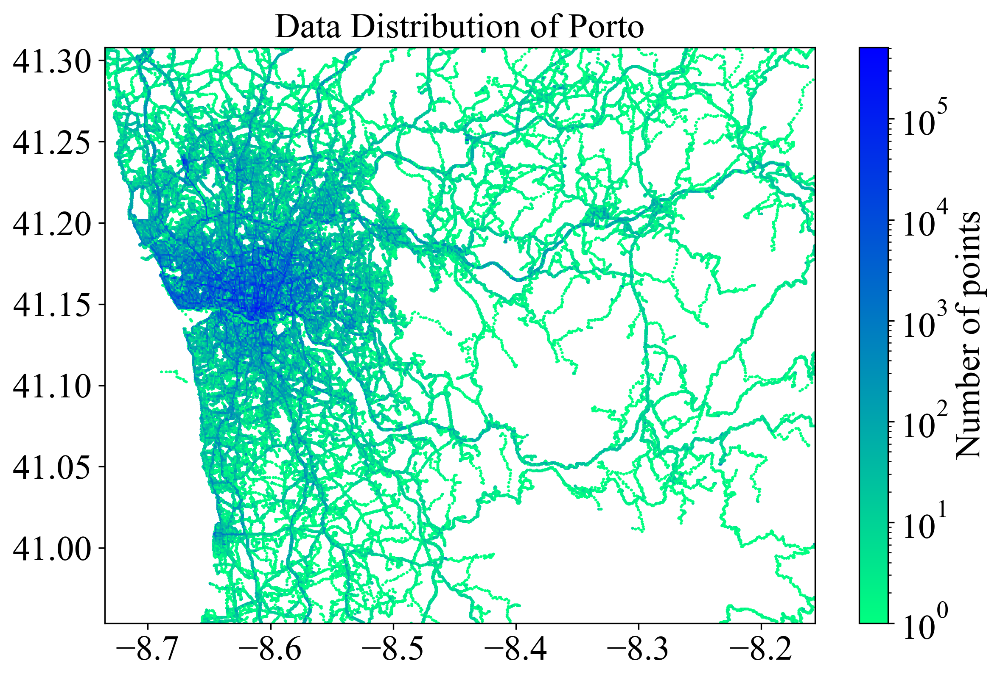
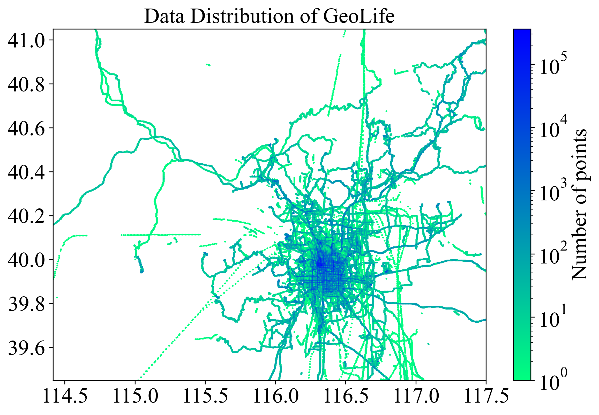
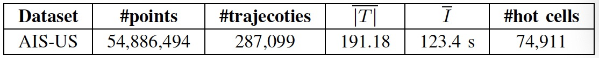
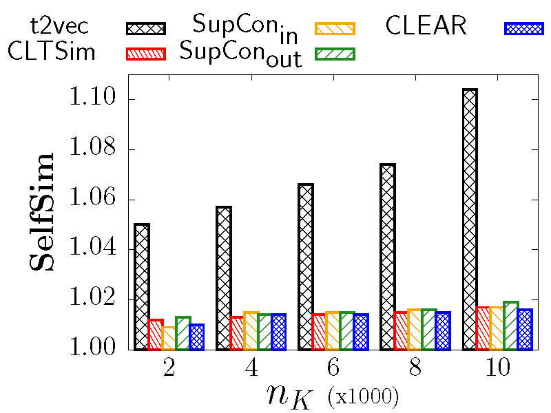
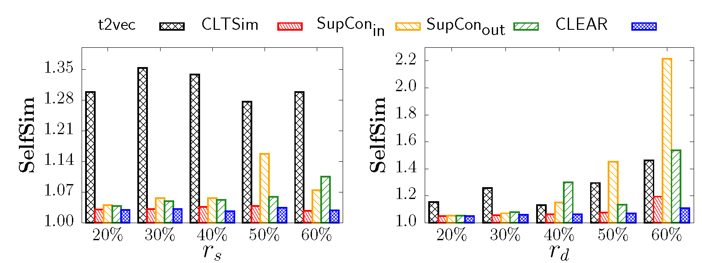
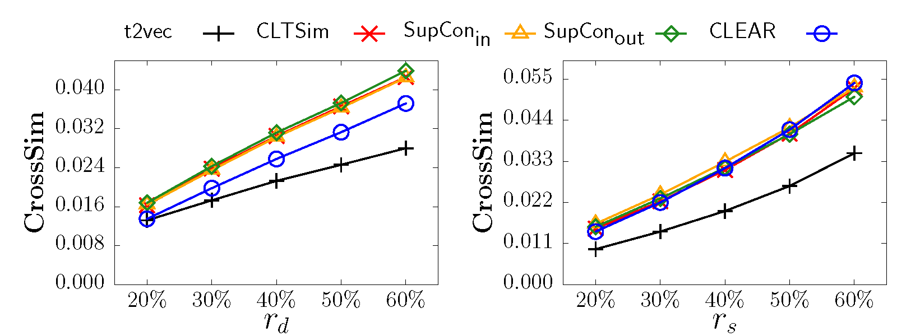
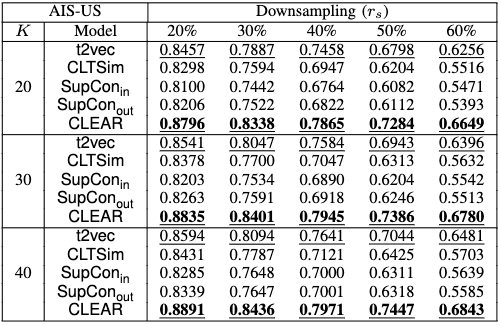

This repository contains the code used in paper "CLEAR: Ranked Multi-Positive Contrastive Representation Learning for Robust Trajectory Similarity Computation"
# Requirements
- Ubuntu OS
- Python 3.9.13 (tested)
- PyTorch 1.13.0 (tested)

 # Preprocessing
 We mainly follow [t2vec](https://github.com/boathit/t2vec#readme) to preprocess the datasets but reproduce all Julia scripts in Python.
 We suppport three trajectory datasets of different moving objects. They're "[porto](https://www.kaggle.com/c/pkdd-15-predict-taxi-service-trajectory-i)", "[geolife](https://www.microsoft.com/en-us/research/publication/geolife-gps-trajectory-dataset-user-guide/)" and "[aisus](https://marinecadastre.gov/ais/)". Taking "porto" as example, our preprocessing includes several steps:
 1. Unify the datasets in diffrent formats:  
    ```python unify/run_unify.py -dataset_name "porto"```  
    Then you'll get a .csv file called "porto_filter.csv" and a .h5 file called "porto_filter.csv" and "porto.h5" respectively in "data/porto".  
 2. Data augmentation.  
    ```python augmentation/run_augmentation.py -dataset_name "porto"```  
    Then you'll get a series of .h5 file named such as "porto_distort_rate_0.2.h5" in "data/porto/augmentation". Feel free to use multiprocessing :-)
3. Token generation.  
   ```python token_generation/run_token.py -dataset_name "porto" -cell_size 100 -minfreq 50```  
   Then you'll get a series of .h5 file named such as "porot_distort_rate_0.2_seq.h5" in "data/porto/token/cell-100_minfreq-50". Again, feel free to use multiprocessing.

# Training
You can train CLEAR with the following settings.   
```python main.py -dataset_name "porto" -combination "single" -loss "pos-rank-out-all" -batch_size 64 -spatial_type "grid" -cell_size 100 -minfreq 50 -aug1_name "distort" -aug1_rate 0.4 -aug2_name "downsampling" -aug2_rate 0.4```  
The trained model will be saved in "{}_checkpoint.pt" and "{}_best.pt". To facilicate the ablation study, they'll be named such as "clear-S_grid_cell-100_minfreq-50_multi-single-downsampling-distort-246_pos-rank-out-all_batch-64_porto_checkpoint.pt" and saved in "data/porto". To reproduce the results of the other variants mentioned in our paper, you can modify the parameters such as combination, loss, batch_size, cell_size and minfreq to corresponding values.  

# Evaluation
We support three types of evaluation metrics, i.e., "self-similarity", "cross-similarity" and "knn". Taking "self-similarity" as an example, you can follow the next steps to reproduce the results.  
1. Prepare experimental dataset.  
   ```python ./experiment/experiment.py -mode data -dataset_name "porto" -exp_list "self-similarity" -spatial_type "grid" -cell_size 100 -minfreq 50```  
   Then you'll get the experimental dataset in "experiment/self-similarity/porto/cell-100-minfreq-50".  
2. Encode.  
   ```python ./experiment/experiment.py -mode encode -dataset_name "porto" -exp_list "self-similarity" -spatial_type "grid" -cell_size 100 -minfreq 50 -combination "single" -loss "pos-rank-out-all" -batch_size 64 -aug1_name "distort" -aug1_rate 0.4 -aug2_name "downsampling" -aug2_rate 0.4```  
   Then you'll get the encoded vector for self-similarity experimental set named with a suffix corresponding to your model, in "experiment/self-similarity/porto/cell-100-minfreq-50"
3. Experiment.
   ```python experiment.py -mode encode -dataset_name "porto" -exp_list "self-similarity" -spatial_type "grid" -cell_size 100 -minfreq 50 -combination "single" -loss "pos-rank-out-all" -batch_size 64 -aug1_name "distort" -aug1_rate 0.4 -aug2_name "downsampling" -aug2_rate 0.4```
   Then you'll get the experimental results (.csv file) in "experiment".

# Appendix
## Point distribution of datasets 
<p align="center">

</p>
<p align="center">
  <strong><span style="font-size:larger;">Fig. 1:</span></strong> Point distribution of all datasets
</p>


## Results on AIS-US
**AIS-US** is collected by the U.S. Coast Guard and contains daily trajectories of various vessels in the U.S. Here we adopt a subset from 4th April, 2022 to 10th April, 2022. To separate the original records with stop points and missing points in AIS-US, we set $I_{stop}$ to 1,800 s and $I_{miss}$ to 1,800 s. We summarize some statistics of the processed dataset next.

<p align="center">
  
</p>
<p align="center">
  <strong><span style="font-size:larger;">Fig. 2:</span></strong> Statistics of AIS-US
</p>

Then we show the results of self-similarity, cross-similarity and kNN search on AISUS. Unsurprisingly, CLEAR still performs well on self-similarity and kNN search. However, it cannot beat t2vec on cross-similarity. We also notice that t2vec wins many runner-ups in kNN search. We argue that this is due to the sparse distribution of AIS-US compared with the other datasets, which rendering in simpler reconstructive task for generative models. 

<p align="center">
  
</p>
<p align="center">
  <strong><span style="font-size:larger;">Fig. 3:</span></strong> Effect of <span style="font-size:larger;">$n_k$</span> on self-similarity for AIS-US
</p>
<p align="center">
  
</p>
<p align="center">
  <strong><span style="font-size:larger;">Fig. 4:</span></strong> Effect of distortion and downsampling on self-similarity for AIS-US
</p>
<p align="center">
  
</p>
<p align="center">
  <strong><span style="font-size:larger;">Fig. 5:</span></strong> Effect of distortion and downsampling on cross-similarity for AIS-US
</p>
<p align="center">
  
</p>
<p align="center">
  <strong><span style="font-size:larger;">Fig. 6:</span></strong> Effect of distortion on kNN search precision for AIS-US
</p>
<p align="center">
  
</p>
<p align="center">
  <strong><span style="font-size:larger;">Fig. 7:</span></strong> Effect of downsamling on kNN search precision for AIS-US
</p>


   
 
